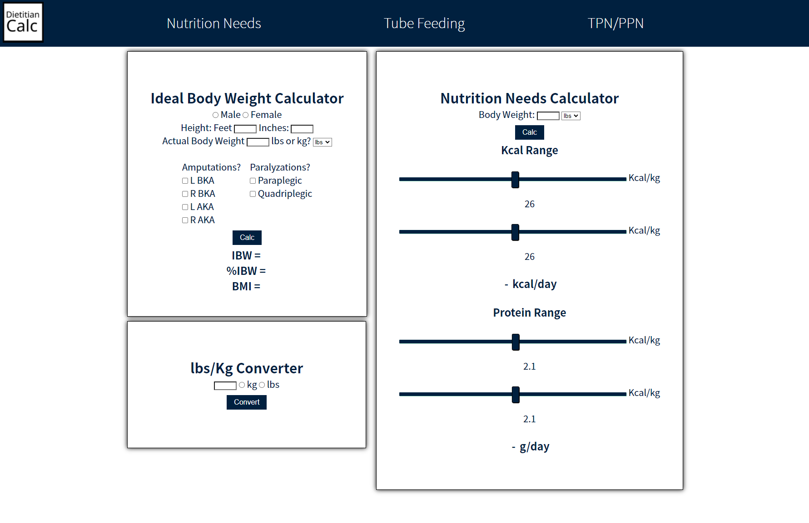
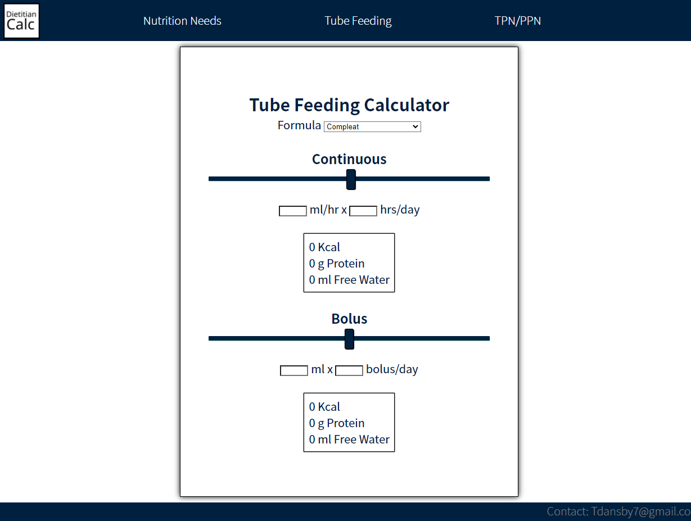

# **Dietitian Calc**
### Vanilla JS App made for Dietitians to do calculations.
[Link to Webpage](https://dietitiancalc.com/)
## Table of Contents
  - [Introduction](#introduction)
  - [Technologies](#technologies)
  - [Features](#features)
  - [Screenshots](#screenshots)
  - [Room for Improvement](#room-for-improvement)
  - [Sources](#sources)
  - [Contact](#contact)
## Introduction
  This project is intended to be a tool for dietitians to make day to day calculations easier. Dietitian Calc uses vanilla JS, HTML, and CSS. There are 3 pages in total (nutrition needs, tube feeding, and TPN/PPN) for the user to pick the calculator they want to use. 
## Technologies
 - HTML
 - CSS
 - JS
## Features
- Vanilla JS/HTML/CSS
- Nutrition Needs Calculator
- Tube feeding Calculator
- TPN/PPN Calculator
## Screenshots
 - Nutrition Needs Calculator

 - Tube Feeding Calculator

## Room for Improvement
- Add tube feeding modulars 
- Add ability to calculate water flushes
- Add different nutrition needs formulas, (Penn state, Mifflin St. Jeor)
- Add more tube feeding formulas (pediatric formulas)
## Sources
- Kate farms (https://www.katefarms.com/)
- Abbot (https://abbottnutrition.com/)
- Nestle (https://www.nestlehealthscience.us/)
## Contact
- Tdansby7@gmail.com
- [LinkedIn](linkedin.com/in/tyler-dansby-rd-39541916b)